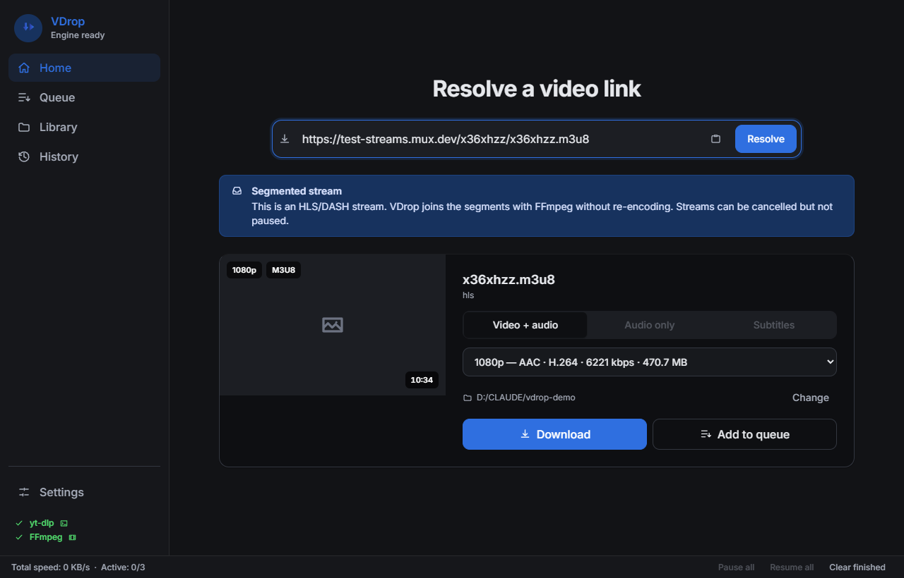
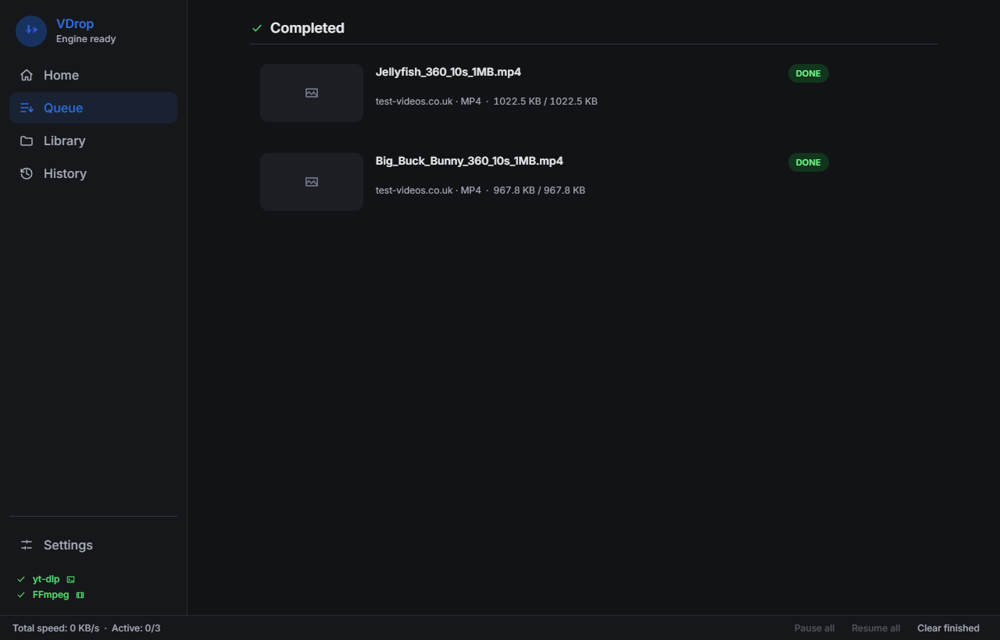
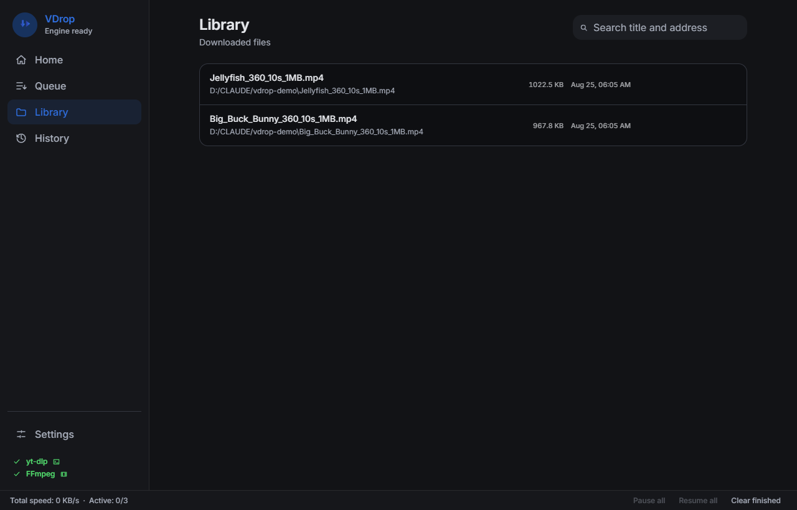
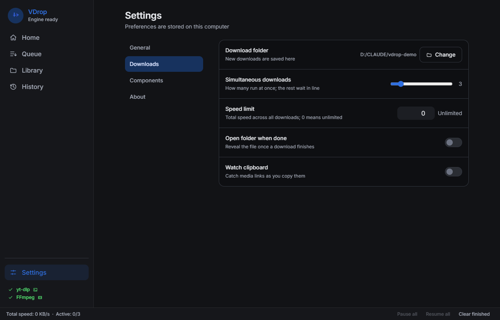

# VDrop

A native desktop media downloader with a Rust core. You paste a link, VDrop
tells you what is behind it, and you choose what to download.

React and TypeScript only draw the interface. Downloading, files, networking
and the database are native Rust behind Tauri 2, so a build produces a real
program you double-click: `.exe` on Windows and `.dmg` on macOS.



## What it does

- **Tells you what is there before anything downloads.** Paste a link and you
  get a real list: resolutions, codecs, bitrates and size estimates. Nothing
  starts until you pick one.
- **Resumable HTTP.** Interrupted downloads continue with Range requests, and
  survive closing the app.
- **HLS and DASH.** Segments are joined by FFmpeg without re-encoding, so
  there is no quality loss and almost no CPU cost.
- **Subtitles.** Subtitle tracks in HLS masters are listed by language and
  downloaded as SRT.
- **Hundreds of sites, if you want them.** With yt-dlp installed, site
  specific extraction comes with it. Without it, direct links and manifests
  still work.
- **Pause and resume mean the same thing everywhere.** Pausing ends the
  transfer and keeps the partial file, so a paused download does not sit on a
  concurrency slot.
- **A shared speed limit.** One bucket across all HTTP downloads, changeable
  while they run, so a large download does not take the whole line.
- **Clipboard watching that never fetches.** It offers a caught link; it does
  not request it. Clipboards carry internal addresses and password resets.
- **20 languages**, including right-to-left.

| Queue | Library | Settings |
|---|---|---|
|  |  |  |

## Intended use

VDrop is a tool for downloading media **you have the right to download**:
your own uploads, material you are licensed to keep, public domain and
openly licensed works, and content whose terms allow local copies.

**It does not circumvent DRM.** When a provider reports DRM protected
content, VDrop refuses it and says so; there is no code here that removes or
works around a technical protection measure, and contributions that add such
code will not be accepted.

You remain responsible for respecting copyright and the terms of the services
you use. Please do not open issues that include links to material you are not
allowed to download.

## Install

Download the installer for your platform from the
[Releases](../../releases) page.

The installers are produced by `.github/workflows/release.yml`, which runs when
a `v*` tag is pushed - until such a tag exists the Releases page is empty and
there is nothing to download.

Windows builds are not code-signed yet, so SmartScreen warns on first run.

### Build from source

Requires [Rust](https://rustup.rs) and [Node.js](https://nodejs.org) 20+, plus
the [Tauri prerequisites](https://tauri.app/start/prerequisites/) for your
platform.

```bash
npm install
npm run tauri:build     # installers land in src-tauri/target/release/bundle/
```

For development:

```bash
npm run tauri:dev       # real window, live reload
npm run dev             # interface only, in a browser, with a fake IPC layer
```

## Optional components

Both are looked up on `PATH` and in the application's own `bin/` folder.
Settings, then Components, shows what was found.

yt-dlp gives site-specific extraction; FFmpeg joins HLS/DASH segments.

```powershell
# Windows
pip install -U yt-dlp
winget install ffmpeg
```

```bash
# macOS
brew install yt-dlp ffmpeg
```

Settings, then Components, shows the command for the machine you are actually
on. Neither program is bundled with VDrop, and neither is required: without
them, direct media links still download.

## How it is built

```
frontend/                React + TypeScript (interface)
    │  Tauri IPC — 19 commands, one event channel
    ▼
src-tauri/               desktop shell (thin wiring only)
    ├── vdrop-download   resumable HTTP + filename safety
    ├── vdrop-media      HLS/DASH, the FFmpeg pipeline
    ├── vdrop-providers  URL to MediaInfo (hls, dash, web, page extraction)
    ├── vdrop-ytdlp      optional: yt-dlp extraction and downloading
    └── vdrop-storage    SQLite, forward-only migrations
```

The rule the codebase holds to: business logic lives in the crates, not in the
shell. The core is testable in seconds without Tauri.

`docs/ARCHITECTURE.md` has the long version.

## Verification

```bash
npm test             # cargo test --workspace
npm run test:front   # vitest
npm run lint         # cargo clippy -D warnings
npm run test:live    # needs network; hits real servers
```

217 unit tests and 12 live network tests pass; clippy is clean in both trees.

Live tests are marked `#[ignore]` so a machine without network does not see a
red suite. They exist because the parser being right does not mean the right
file lands on disk: one of them picks a non-default quality and then measures
the resolution of what actually downloaded. Without it, a user could pick
1080p, receive 240p, and only find out on playback.

`docs/DURUM.md` (Turkish) is the working log: what is verified and how, what
is not, the decisions behind the design, and a list of real defects found
along the way. It is worth reading before changing anything.

## Contributing

See [CONTRIBUTING.md](CONTRIBUTING.md). Short version: keep logic out of the
shell, explain *why* in comments, and look at the interface when you change
it - several defects here passed every test and were still visibly wrong.

## License

[MIT](LICENSE).

FFmpeg and yt-dlp are separate programs under their own licenses and are not
distributed with VDrop.
